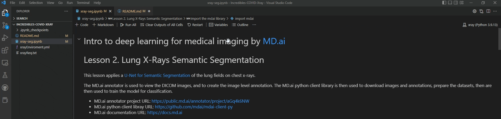

<main>
    

        <h1>Welcome to the Incredible COVID Detections from X-rays</h1>
        

            <h2>How to Run:</h2>
            

                
1. Create a base enviroment called xray on python 3.9: 

                <pre><code>conda create -n xray python=3.9
                </code></pre>
            

            

                
2. Activate the conda environment tflabs: 

                <pre><code>conda activate xray
                </code></pre>
            

            

                
3. Cd into the directory of xrayReq.txt then run: 

                <pre><code>pip install -r xrayReq.txt
                </code></pre>
            

            

                
4a. Through terminal open notebook 

                <pre><code>jupyter notebook &
                </code></pre>
            

            

                
4b. Or through vscode install the extension. Then open the notebook(s) and enviroment 

            

        

    

</main>

